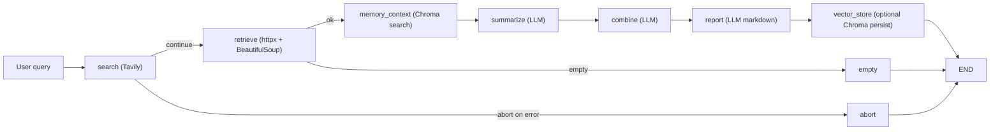
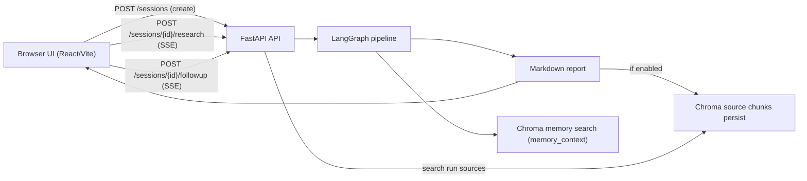

# Research Agent

A multi-step AI research pipeline built with **LangGraph**, **Tavily**, and **LangChain** that automates web research and produces structured markdown reports.


## Architecture



Each node is a pure function that receives and returns a `ResearchState` TypedDict. Conditional edges handle error cases and empty result sets without crashing the pipeline.

## Tech Stack

| Area | Technologies / Tools |
|---|---|
| Language | Python 3.11+, TypeScript |
| Orchestration | LangGraph |
| LLM Layer | LangChain, OpenAI, Ollama |
| Web Research | Tavily |
| Retrieval & Parsing | httpx, BeautifulSoup4 |
| API | FastAPI, Uvicorn, SSE |
| CLI | Typer, Rich |
| Vector Memory | ChromaDB |
| Frontend | React 19, Vite, react-markdown, lucide-react |
| Code Quality | Pytest, Ruff, mypy, ESLint |

## Features

| Feature | Detail |
|---|---|
| LangGraph State Machine | TypedDict state, conditional edges |
| Multi-LLM support | OpenAI or Ollama — switched by env var |
| Retry logic | Exponential back-off on search and fetch |
| Streaming API | FastAPI SSE endpoint for real-time progress |
| CLI | Typer + Rich for beautiful terminal output |
| Vector storage | ChromaDB for persisting and searching reports |
| Research sessions | Server-side session store tracks conversation history and run metadata |
| Follow-up chat | ChatGPT-style chat grounded to the same sources as the research report |
| Per-run source chunks | Source passages are chunked, stored, and retrieved per run for grounded answers |
| LangSmith observability | Full workflow tracing: root runs, node spans, external calls, and failure context |

## Quick Start

### 1. Install

```bash
python -m venv .venv
source .venv/bin/activate
pip install -e ".[dev]"
```

### 2. Configure

```bash
cp .env.example .env
# Edit .env — set OPENAI_API_KEY and TAVILY_API_KEY
```

### 3. Run the CLI

```bash
# Run a research query
python -m src.main search "What is LangGraph?"

# Save report to file
python -m src.main search "What is LangGraph?" --output report.md

# Also persist to ChromaDB
python -m src.main search "What is LangGraph?" --vector-store

# Start the API server
python -m src.main serve --reload
```

### 4. Run the demo script

```bash
bash scripts/demo.sh "How does retrieval-augmented generation work?"
```

## UI (Frontend)

The `ui/` app provides a browser interface for:
- entering research queries
- streaming node-by-node progress from the backend
- rendering the final markdown report
- follow-up chat grounded to the same sources (ChatGPT-style, requires sessions)

Install and run:

```bash
cd ui
npm install
npm run dev
```

Build and preview production assets:

```bash
cd ui
npm run build
npm run preview
```

Frontend API configuration:
- The UI reads `VITE_API_BASE_URL`.
- If unset, it defaults to `http://localhost:8000`.

Run backend + frontend together (two terminals):

```bash
# Terminal 1 (repo root)
python -m src.main serve --reload

# Terminal 2
cd ui
npm run dev
```



## API

Start the server:

```bash
python -m src.main serve
```

| Endpoint | Method | Description |
|---|---|---|
| `/health` | `GET` | Liveness probe |
| `/research` | `POST` | Run pipeline with SSE streaming (sessionless) |
| `/sessions` | `POST` | Create a new research session |
| `/sessions/{id}` | `GET` | Get session state and conversation history |
| `/sessions/{id}/research` | `POST` | Run pipeline within a session (SSE); returns `X-Run-Id` header |
| `/sessions/{id}/followup` | `POST` | Ask a follow-up question grounded to a run's sources (SSE) |

Example — sessionless research:

```bash
curl -N -X POST http://localhost:8000/research \
  -H "Content-Type: application/json" \
  -d '{"query": "What is LangGraph?", "use_vector_store": false}'
```

Example — session-based research + follow-up:

```bash
# 1. Create session
SESSION=$(curl -s -X POST http://localhost:8000/sessions | jq -r '.session_id')

# 2. Run research (note X-Run-Id response header)
curl -N -X POST http://localhost:8000/sessions/$SESSION/research \
  -H "Content-Type: application/json" \
  -D - \
  -d '{"query": "What is LangGraph?", "use_vector_store": true}'

# 3. Ask a follow-up (uses the latest run by default)
curl -N -X POST http://localhost:8000/sessions/$SESSION/followup \
  -H "Content-Type: application/json" \
  -d '{"question": "Can it work without LangChain?"}'
```

SSE event types:

```json
{"type": "node",      "node": "search",  "status": "running"}
{"type": "node",      "node": "report",  "status": "completed", "data": {"report": "# Report ..."}}
{"type": "chunk",     "text": "token..."}
{"type": "citations", "citations": [{"source_url": "...", "source_title": "..."}]}
{"type": "done"}
{"type": "error",     "error": "message"}
```

## LangSmith Observability

The pipeline includes end-to-end LangSmith instrumentation, so you can track the entire multi-step flow in one place.

- A single **root run** is created per workflow execution (CLI or API).
- Every graph node (`search`, `retrieve`, `memory_context`, `summarize`, `combine`, `report`, `vector_store`) is traced as a child span.
- External operations are traced as nested spans (Tavily search, URL fetch, LLM calls, Chroma reads/writes).
- Routing and terminal outcomes are visible (`continue`, `abort`, `empty`) with status and timing context.
- Redaction-by-default protects sensitive payloads while preserving useful debugging metadata.

You get full observability from input to final report: where time is spent, where failures happen, and how data moves through the workflow.

## Environment Variables

| Variable | Default | Description |
|---|---|---|
| `LLM_PROVIDER` | `openai` | `openai` or `ollama` |
| `OPENAI_API_KEY` | — | Required for OpenAI |
| `OPENAI_MODEL` | `gpt-4o-mini` | OpenAI model name |
| `OLLAMA_BASE_URL` | `http://localhost:11434` | Ollama server URL |
| `OLLAMA_MODEL` | `llama3.2` | Ollama model name |
| `TAVILY_API_KEY` | — | Required for web search |
| `CHROMA_PERSIST_DIRECTORY` | `./chroma_db` | ChromaDB storage path |
| `MAX_SEARCH_RESULTS` | `5` | Number of Tavily results |
| `ENABLE_SESSIONS` | `true` | Enable research sessions and follow-up chat |
| `LANGSMITH_TRACING` | `false` | Enable LangSmith tracing (`true`/`false`) |
| `LANGSMITH_PROJECT` | `research-agent` | LangSmith project name |
| `LANGSMITH_API_KEY` | — | LangSmith API key |
| `LANGSMITH_ENDPOINT` | `https://api.smith.langchain.com` | LangSmith API endpoint |
| `LANGSMITH_REDACTION_MODE` | `redacted_default` | `full_payloads`, `redacted_default`, or `metadata_only` |
| `LANGSMITH_SAMPLING_RATE` | `1.0` | Fraction of workflow runs to trace (0.0-1.0) |

When `LANGSMITH_TRACING=true`, workflow runs and per-node spans are sent to LangSmith with redaction-by-default payload handling.

## Development

```bash
# Run tests
pytest -v

# Lint
ruff check src

# Type check
mypy src
```

## Project Structure

```
src/
├── config.py           # Pydantic-settings config (feature flags, env vars)
├── errors.py           # Custom exceptions
├── main.py             # Typer CLI
├── sessions.py         # In-memory session store (Session, SessionRun, ConversationTurn)
├── llm/factory.py      # LLM factory (OpenAI / Ollama)
├── graph/
│   ├── state.py        # ResearchState TypedDict
│   ├── nodes.py        # All pipeline nodes
│   ├── edges.py        # Conditional routing
│   └── graph.py        # LangGraph compile
├── tools/
│   ├── search.py       # Tavily + retry
│   ├── fetcher.py      # Async URL fetcher
│   └── vector_store.py # ChromaDB manager (reports + per-run source chunks)
└── api/endpoints.py    # FastAPI + SSE (research, sessions, follow-up)
ui/
├── src/
│   ├── App.tsx                       # Main UI shell — session lifecycle, state
│   ├── types.ts                      # Shared TypeScript types
│   ├── api/client.ts                 # SSE client (research, sessions, follow-up)
│   ├── components/ChatForm.tsx       # Query input form
│   ├── components/ResearchProgress.tsx
│   ├── components/ReportViewer.tsx
│   └── components/FollowupChat.tsx   # ChatGPT-style follow-up chat
└── package.json                      # Vite scripts and deps
```
