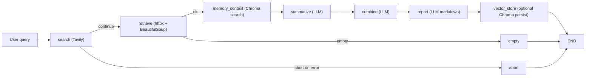
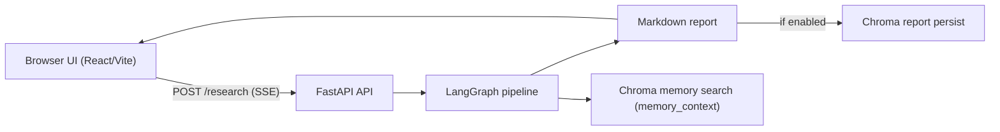

# Research Agent

A multi-step AI research pipeline built with **LangGraph**, **Tavily**, and **LangChain** that automates web research and produces structured markdown reports.


## Architecture



Each node is a pure function that receives and returns a `ResearchState` TypedDict. Conditional edges handle error cases and empty result sets without crashing the pipeline.

## Tech Stack

| Area | Technologies / Tools |
|---|---|
| Language | Python 3.11+, TypeScript |
| Orchestration | LangGraph |
| LLM Layer | LangChain, OpenAI, Ollama |
| Web Research | Tavily |
| Retrieval & Parsing | httpx, BeautifulSoup4 |
| API | FastAPI, Uvicorn, SSE |
| CLI | Typer, Rich |
| Vector Memory | ChromaDB |
| Frontend | React 19, Vite, react-markdown, lucide-react |
| Code Quality | Pytest, Ruff, mypy, ESLint |

## Features

| Feature | Detail |
|---|---|
| LangGraph State Machine | TypedDict state, conditional edges |
| Multi-LLM support | OpenAI or Ollama — switched by env var |
| Retry logic | Exponential back-off on search and fetch |
| Streaming API | FastAPI SSE endpoint for real-time progress |
| CLI | Typer + Rich for beautiful terminal output |
| Vector storage | ChromaDB for persisting and searching reports |

## Quick Start

### 1. Install

```bash
python -m venv .venv
source .venv/bin/activate
pip install -e ".[dev]"
```

### 2. Configure

```bash
cp .env.example .env
# Edit .env — set OPENAI_API_KEY and TAVILY_API_KEY
```

### 3. Run the CLI

```bash
# Run a research query
python -m src.main search "What is LangGraph?"

# Save report to file
python -m src.main search "What is LangGraph?" --output report.md

# Also persist to ChromaDB
python -m src.main search "What is LangGraph?" --vector-store

# Start the API server
python -m src.main serve --reload
```

### 4. Run the demo script

```bash
bash scripts/demo.sh "How does retrieval-augmented generation work?"
```

## UI (Frontend)

The `ui/` app provides a browser interface for:
- entering research queries
- streaming node-by-node progress from the backend
- rendering the final markdown report

Install and run:

```bash
cd ui
npm install
npm run dev
```

Build and preview production assets:

```bash
cd ui
npm run build
npm run preview
```

Frontend API configuration:
- The UI reads `VITE_API_BASE_URL`.
- If unset, it defaults to `http://localhost:8000`.

Run backend + frontend together (two terminals):

```bash
# Terminal 1 (repo root)
python -m src.main serve --reload

# Terminal 2
cd ui
npm run dev
```



## API

Start the server:

```bash
python -m src.main serve
```

| Endpoint | Method | Description |
|---|---|---|
| `/health` | `GET` | Liveness probe |
| `/research` | `POST` | Run pipeline with SSE streaming |

Example SSE request:

```bash
curl -N -X POST http://localhost:8000/research \
  -H "Content-Type: application/json" \
  -d '{"query": "What is LangGraph?", "use_vector_store": false}'
```

Each event:

```json
{"node": "search_node", "data": {}}
{"node": "report_node", "data": {"report": "# Report ..."}}
{"node": "__end__", "data": {}}
```

## Environment Variables

| Variable | Default | Description |
|---|---|---|
| `LLM_PROVIDER` | `openai` | `openai` or `ollama` |
| `OPENAI_API_KEY` | — | Required for OpenAI |
| `OPENAI_MODEL` | `gpt-4o-mini` | OpenAI model name |
| `OLLAMA_BASE_URL` | `http://localhost:11434` | Ollama server URL |
| `OLLAMA_MODEL` | `llama3.2` | Ollama model name |
| `TAVILY_API_KEY` | — | Required for web search |
| `CHROMA_PERSIST_DIRECTORY` | `./chroma_db` | ChromaDB storage path |
| `MAX_SEARCH_RESULTS` | `5` | Number of Tavily results |

## Development

```bash
# Run tests
pytest -v

# Lint
ruff check src

# Type check
mypy src
```

## Project Structure

```
src/
├── config.py           # Pydantic-settings config
├── errors.py           # Custom exceptions
├── main.py             # Typer CLI
├── llm/factory.py      # LLM factory (OpenAI / Ollama)
├── graph/
│   ├── state.py        # ResearchState TypedDict
│   ├── nodes.py        # All pipeline nodes
│   ├── edges.py        # Conditional routing
│   └── graph.py        # LangGraph compile
├── tools/
│   ├── search.py       # Tavily + retry
│   ├── fetcher.py      # Async URL fetcher
│   └── vector_store.py # ChromaDB manager
└── api/endpoints.py    # FastAPI + SSE
ui/
├── src/
│   ├── App.tsx                 # Main UI shell/state
│   ├── api/client.ts           # Health + SSE stream client
│   ├── components/ChatForm.tsx # Query input form
│   ├── components/ResearchProgress.tsx
│   └── components/ReportViewer.tsx
└── package.json                # Vite scripts and deps
```
